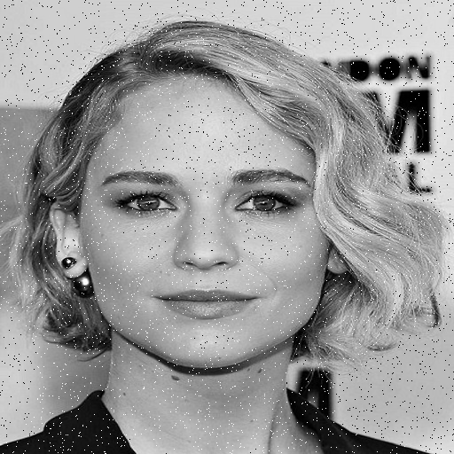

# SaltAndPepper_laba3
Median filter for Image 

### Task definition
Given the image of size M×N with “Salt and Pepper” noise, implement and apply a CUDA version of 9-point median filter and store the result to output image. Missing values for edge rows and columns are to be taken from nearest pixels. CUDA implementation must make use of texture memory. 

#### Input data
• image with "Salt and Pepper" noise

#### Output data

### Results

The average time in milliseconds for 5 measurements for the same image with different size

|   Image Size  | time CPU |  time GPU   | 
|---------------|----------|-------------|
| 64x64         | 3 ms     | 0.18346 ms  |
| 128x128       | 11 ms    | 0.61492 ms  |
| 256x256       | 43,2 ms  | 2.1073  ms  |
| 512x512       | 170,8 ms | 8.18416 ms  |
| 1024x1024     | 664 ms   | 31.73298 ms |

   
